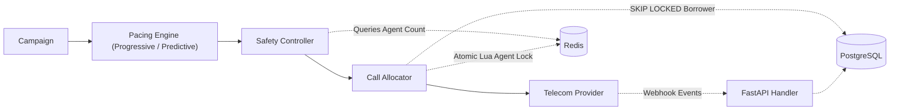
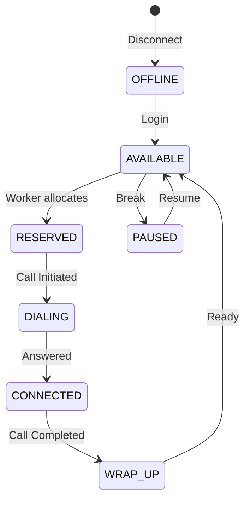
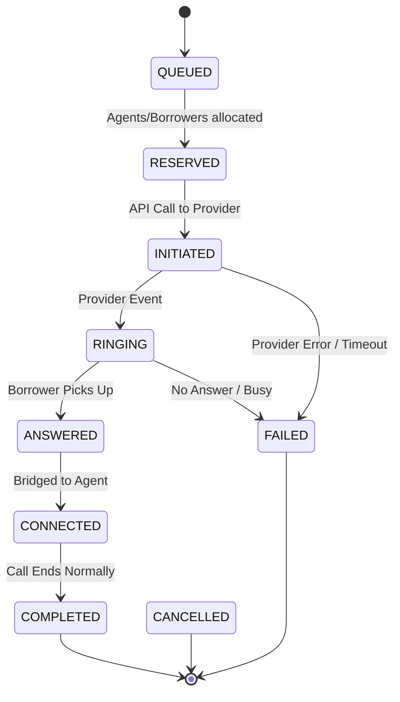

# Architecture Decision Document

## 1. Tech Stack Choices
*   **Python / FastAPI:** Chosen for its native asynchronous capabilities, perfect for handling high-throughput telecom webhooks without blocking.
*   **PostgreSQL:** Chosen over Redis or Kafka because a relational database natively solves the hardest concurrency requirements of this assignment through atomic transactions and row-level locking.

## 2. Solving Concurrency & Idempotency
*   **Agent Allocation:** We prevent two workers from reserving the same agent using `SELECT ... FOR UPDATE SKIP LOCKED`. This guarantees atomicity. If Worker A locks an agent row, Worker B instantly skips it and grabs the next available agent without waiting or causing a race condition.
*   **Duplicate Events:** Solved via a `UNIQUE` constraint on the `provider_events_log.provider_event_id` column. If a mock provider sends "ANSWERED" multiple times, the database rejects the duplicates at the transaction level.

## 3. The Scaling Bottleneck (10,000 Agents)
If the system scales from 1,000 to 10,000 agents, **the PostgreSQL connection pool and lock contention will break first**. Thousands of workers executing `FOR UPDATE` queries simultaneously will exhaust database connections and spike CPU utilization due to lock management. 
*   **The Fix:** I would introduce **PgBouncer** for connection multiplexing. If that is insufficient, I would migrate the transient agent state tracking from PostgreSQL to **Redis**, utilizing atomic Lua scripts for high-speed, lock-free agent allocation, reserving PostgreSQL only for immutable historical call records.

## 4. Final Question: Predictive Benefits with Progressive Safety
*Question: How would you build a SmartDialer that gets as much of the utilization benefit of predictive dialing as possible, while retaining the deterministic safety characteristics of progressive dialing?*

**Answer:** 
The solution is absolute decoupling of the *decision* to dial from the *execution* of the dial. The pacing engine should run aggressively as a purely statistical "suggester" (Predictive), continuously filling an in-memory queue with proposed calls based on predictive algorithms. 

However, the telecom execution layer must be strictly gated by a synchronous, state-aware Safety Controller (Progressive). Before any call actually leaves the network boundary, the Controller performs a deterministic, real-time lock on an actual `AVAILABLE` agent. If no agent lock can be secured, the call request is dropped or deferred. This hybrid model uses predictive math to ensure the pipeline is always full, but enforces progressive mechanics to guarantee a call is never placed without a guaranteed recipient.

---

## 5. System Architecture

---

## 6. State Machines

### Agent State Machine

### Call State Machine
